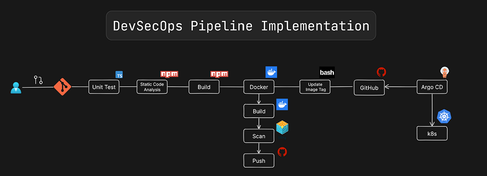

# Secure GitOps AKS Platform

A production-style DevSecOps platform on AKS that combines GitOps, software supply-chain security, policy-as-code, and progressive delivery.

This repository demonstrates an end-to-end path from developer commit to safe Kubernetes rollout.

## Architecture Diagram



## Why This Project

Most demos show one or two tools in isolation. This platform intentionally combines:
- GitOps with Argo CD
- Image security with Trivy and Cosign
- Runtime policy enforcement with Kyverno
- Progressive canary deployments with Argo Rollouts

The result is a realistic blueprint for secure cloud-native delivery.

## Core Stack

- Kubernetes: Azure Kubernetes Service (AKS)
- GitOps: Argo CD
- Policy Engine: Kyverno
- Progressive Delivery: Argo Rollouts
- Container Registry: Azure Container Registry (ACR)
- CI/CD: GitHub Actions
- Image Scanning: Trivy
- Image Signing: Cosign

## End-to-End Flow

Developer push
-> GitHub
-> GitHub Actions CI
-> Build container image
-> Trivy vulnerability scan
-> Cosign signature
-> Push image to ACR
-> Update GitOps manifests
-> Argo CD sync to AKS
-> Kyverno admission validation
-> Argo Rollouts canary progression
-> Stable production deployment

## Security and Delivery Guarantees

- Signed images only (Cosign verification policy)
- Registry allow-list (ACR-only policy)
- Non-root workload guardrails (namespace-scoped)
- Required CPU/memory limits
- Progressive canary rollout steps before full promotion
- Controlled rollback behavior through rollout strategy

## Repository Structure

```text
.
|- apps/
|  |- demo-app/
|  |  |- deployment.yaml
|  |  |- rollout.yaml
|  |  |- service.yaml
|  |  |- kustomization.yaml
|- gitops/
|  |- argocd-app.yaml
|- helm-values/
|  |- argocd-values.yaml
|- policies/
|  |- kyverno/
|  |  |- require-image-signature.yaml
|  |  |- restrict-image-registries.yaml
|  |  |- require-non-root.yaml
|  |  |- require-resource-limits.yaml
|- .github/workflows/
|  |- ci.yaml
|- Dockerfile
|- cosign.pub
```

## Quick Start

Prerequisites:
- kubectl
- helm
- docker
- cosign
- trivy
- access to AKS and ACR

1. Connect to cluster

```bash
kubectl config current-context
kubectl get nodes
```

2. Install Argo CD (if not installed)

```bash
kubectl create namespace argocd
helm repo add argo https://argoproj.github.io/argo-helm
helm repo update
helm install argocd argo/argo-cd -n argocd
```

3. Apply GitOps app

```bash
kubectl apply -f gitops/argocd-app.yaml
kubectl get applications -n argocd
```

4. Install Kyverno

```bash
helm repo add kyverno https://kyverno.github.io/kyverno
helm repo update
helm install kyverno kyverno/kyverno -n kyverno --create-namespace
kubectl get pods -n kyverno
```

5. Apply Kyverno policies

```bash
kubectl apply -f policies/kyverno/restrict-image-registries.yaml
kubectl apply -f policies/kyverno/require-non-root.yaml
kubectl apply -f policies/kyverno/require-resource-limits.yaml
kubectl apply -f policies/kyverno/require-image-signature.yaml
kubectl get clusterpolicy
```

6. Install Argo Rollouts

```bash
kubectl create namespace argo-rollouts
kubectl apply -n argo-rollouts -f https://github.com/argoproj/argo-rollouts/releases/latest/download/install.yaml
kubectl get pods -n argo-rollouts
```

7. Install Argo Rollouts CLI plugin

```bash
curl -LO https://github.com/argoproj/argo-rollouts/releases/latest/download/kubectl-argo-rollouts-linux-amd64
chmod +x kubectl-argo-rollouts-linux-amd64
sudo mv kubectl-argo-rollouts-linux-amd64 /usr/local/bin/kubectl-argo-rollouts
kubectl argo rollouts version
```

## Progressive Deployment Example

The demo rollout uses a canary strategy in apps/demo-app/rollout.yaml:
- 10% traffic
- pause 30s
- 50% traffic
- pause 30s
- 100% traffic

Useful commands:

```bash
kubectl get rollout
kubectl argo rollouts get rollout demo-nginx
kubectl argo rollouts promote demo-nginx
kubectl argo rollouts promote demo-nginx --full
kubectl argo rollouts abort demo-nginx
```

## CI/CD Pipeline Summary

The workflow in .github/workflows/ci.yaml handles:
- image build
- vulnerability scan
- image signing
- push to ACR
- manifest update for GitOps sync

This creates a clean separation:
- CI builds and secures artifacts
- GitOps deploys declared state

## Validation Scenarios

1. Registry policy test
- Try deploying image: nginx
- Expected: denied by restrict-image-registries

2. Signature policy test
- Deploy unsigned image
- Expected: denied by require-image-signature

3. Resource policy test
- Remove limits from pod spec
- Expected: denied by require-resource-limits

4. Rollout progression
- Update image tag in rollout
- Watch canary progression through pause steps

## Troubleshooting

If workload is denied:

```bash
kubectl get events --sort-by=.lastTimestamp
kubectl describe pod <pod-name>
kubectl get clusterpolicy
```

If rollout is stuck:

```bash
kubectl argo rollouts get rollout demo-nginx
kubectl get rs -l app=demo-nginx
kubectl get pods -l app=demo-nginx
```

If policy blocks control-plane addons, use namespace-scoped exclusions deliberately and document the risk tradeoff.

## Portfolio Highlights

This project demonstrates:
- practical GitOps operations
- Kubernetes security posture design
- policy-driven admission control
- secure software supply chain controls
- safer production release strategy

It is designed as a strong DevOps and platform-engineering portfolio artifact.

## Next Enhancements

- Add AnalysisTemplate-based automated rollback (metrics-driven)
- Add environment overlays (dev/stage/prod) via kustomize
- Add policy report dashboards and alerting
- Add SLSA provenance and SBOM attestation flow

## License

Use this repository for learning, extension, and portfolio demonstration.

